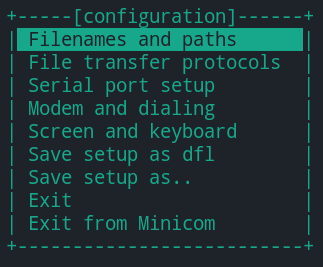

manjaro可选安装的一些软件
---
***
* 安装 输入法  
```
sudo pacman -S fcitx-rime  
sudo pacman -S fcitx-im  
sudo pacman -S fcitx-configtool  
sudo pacman -S fcitx-qt5  
yay -S iflyime      //讯飞输入法  
```
上面操作做完后，你需要编辑一个文件：  
```
sudo gedit ~/.xprofile  
export GTK_IM_MODULE=fcitx  
export QT_IM_MODULE=fcitx  
export XMODIFIERS="@im=fcitx"  
```
建议后面重启一下系统  

***
* 安装TIM
```  
yay -S deepin-wine-tim  
```
***
* 代码编辑器：VSCode
```  
sudo pacman -S visual-studio-code-bin  
```
***
* 安装Clion  
```
yay -S jdk  
yay -S gcc  
sudo pacman -S clion clion-cmake make clion-lldb  
```
***
* 安装git  
```
yay -S git  
git config --global user.name "Michael728"
git config --global user.email "649168982@qq.com"
ssh-keygen -t rst -C "649168982@qq.com"
```
***
* 安装minicom（用于Console线连接交换机）  
```
yay -S minicom
```
配置  
```
sudo minicom -s
```
  
后面随便配置就好了  
配置好了直接，minicom，就直接进去了。  
但是退出有点问题  
首先需使用Ctrl+a 进入设置状态
再按z进入设置菜单（然后就能看到菜单了）  
（1）S键：发送文件到目标系统中；  
（2）W键：自动卷屏。当显示的内容超过一行之後，自动将後面的内容换行。这个功能在查看内核的啓动信息时很有用。  
（3）C键：清除屏幕的显示内容；  
（4）B键：浏览minicom的历史显示；  
（5）X键：退出mInicom，会提示确认退出。  


* 安装迅雷  
```
yaourt -Sy deepin.com.thunderspeed
```

* 安装docker
```
yay -S docker      
sudo systemctl start docker     #启动docker服务
sudo systemctl enable docker    #设置docker开机启动服务
```

仿苹果的dock
```
yay -S latte-dock
```

自用小工具
simple menu(在小工具那边搜索)

谷歌浏览器
yay -S google-chrome